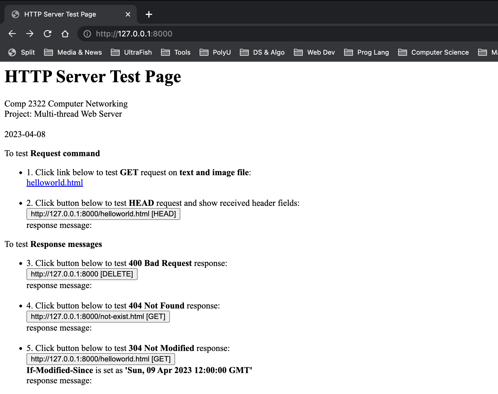
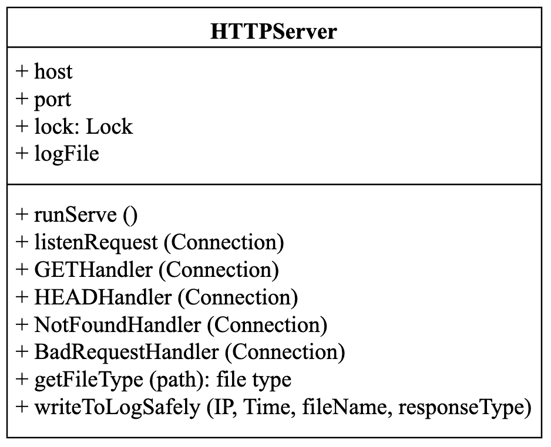
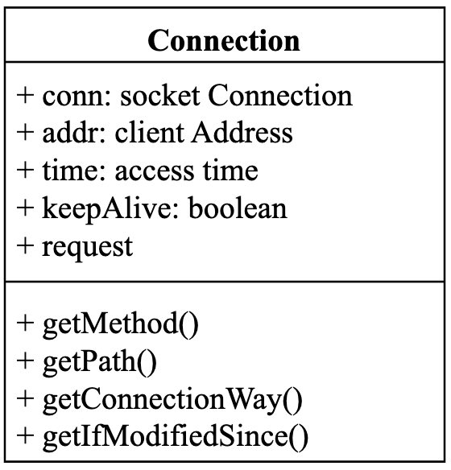
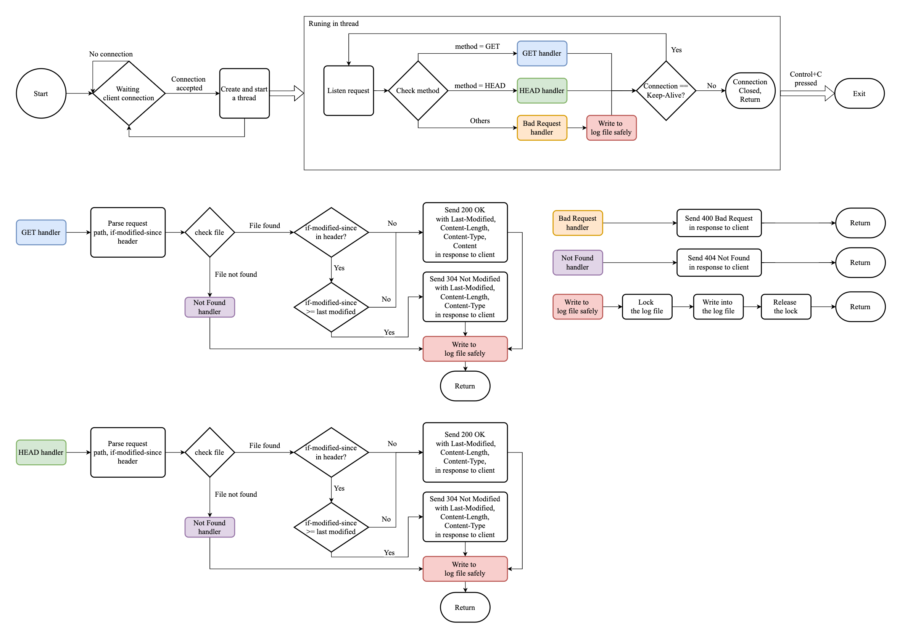

> ***Please carefully read the [Disclaimer of Liability](#disclaimer-of-liability) below first.***  
> All materials in this archive are for reference only. The actual one may vary. 

# Multi-thread_Web_Server_Project
Multi-thread Web Server Project in Python

> *A Course Project of Computer Networking (COMP2322) subject at [The Hong Kong Polytechnic University](https://www.polyu.edu.hk/), made by [ZHANG Wengyu](https://github.com/zhangwengyu999)*

---

## Introduction

In this project, I have designed and implemented a Multi-thread Web Server by socket program using the HTTP protocol, which is able to process HTTP requests sent from client browsers or other client applications.

### Main Functions

- Multi-threaded Web server;
- Handle Connection: Keep-Alive header field;
- Proper request and response message exchange;
- GET command for both text files and image files;
- HEAD command;
- Handle Last-Modified and If-Modified-Since header fields;
- Four types of response statuses (200, 400, 404, 304);
- Logging.

### Demonstration

### Overall Design

 

**HTTPServe** class is the main object of the Web Server. It maintains a list of fields, including server **host**, server **port**, **Lock**, and the **log file**. It also contains a list of methods, including methods mapped to **GET** and **HEAD** request handler, **Not Found** and **Bad Request** Handler, write to log method, as well as other utility methods.

**Connection** class is the abstraction of the connection from the client to the Web Server. It contains **Socket connection** object, client **address**, **access time**, **keep-alive** flag, and the **request message** received from the connection. It also contains methods to parse the request header message, including request **Method**, **Path**, **Connection may**, and **If-Modified-Since**.

### Implementation

---

## User Manual

**Preparation**
1. Python3: 3.9.16
2. Used build-in library: `socket`, `threading`, `os`, `datetime`

**Compile, run and test**
 1. Make sure the abovementioned Preparation is fulfilled.
 2. Open a terminal (cmd), change directory to this folder, then type the following command:
     `python3 HTTPServer.py`
 3. The server is running at http://127.0.0.1:8000 on your localhost, 
    please use your browser to visit http://127.0.0.1:8000.
 4. The "HTTP Server Test Page" is displayed in the browser.
 5. Following the instructions on the webpage to test server's functions.
 6. Received requests and corresponding responses will be printed in the terminal (cmd).
 7. You may also open browser's console by press F12 (fn+F12) to view the responses.
 8. Press `Control+C` in the terminal (cmd) to shutdown the server and exit the program.
 9. Then to test handling the Connection field in the header:
     1. First, exit the server and re-run the server by `python3 HTTPServer.py`
     2. Then, run the client by `python3 ConnCloseTest.py`              
     3. Input `1` in client side for testing Connection: Keep-Alive                      
     4. Input `2` in client side for testing Connection: close                           
     5. Error shows if more requests are sent after 'Connection: close'

---

## Disclaimer of Liability

**The material and information contained on this website is for general information, reference, and self-learning purposes only. You should not rely upon the material or information on the website as a basis for making any academic, business, legal or any other decisions. You should not copy any material or information on the website into any of your academic, business, legal or any other non-private usages. ZHANG Wengyu will not be responsible for any consequences due to your violations.**

Whilst ZHANG Wengyu endeavours to keep the information up to date and correct, ZHANG Wengyu makes no representations or warranties of any kind, express or implied about the completeness, accuracy, reliability, suitability or availability with respect to the website or the information, products, services or related graphics contained on the website for any purpose. Any reliance you place on such material is therefore strictly at your own risk.

ZHANG Wengyu will not be liable for any false, inaccurate, inappropriate or incomplete information presented on the website.

Although every effort is made to keep the website up and running smoothly, due to the nature of the Internet and the technology involved, ZHANG Wengyu takes no responsibility for and will not be liable for the website being temporarily unavailable due to technical issues (or otherwise) beyond its control or for any loss or damage suffered as a result of the use of or access to, or inability to use or access this website whatsoever.

Certain links in this website will lead to websites which are not under the control of ZHANG Wengyu. When you activate these you will leave ZHANG Wengyu's  website. ZHANG Wengyu has no control over and accepts no liability in respect of materials, products or services available on any website which is not under the control of ZHANG Wengyu.

To the extent not prohibited by law, in no circumstances shall ZHANG Wengyu be liable to you or any other third parties for any loss or damage (including, without limitation, damage for loss of business or loss of profits) arising directly or indirectly from your use of or inability to use, this site or any of the material contained in it.
